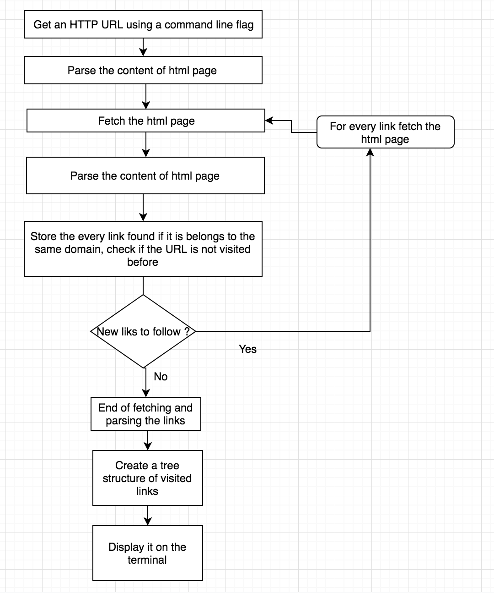
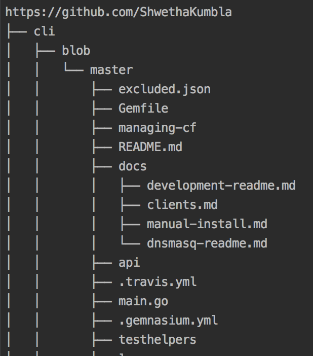

### Simple Web Crawler Tool

  Crawls a single domain, printing out a list of links for each new page that it finds.

### Instructions:

Clone the repo into $GOPATH/src and do the following:

get deps:

     # inside the repo
     $ go get 
   
build server:

    # inside the repo
    $ go build -o webcrawler main.go
   
Run server:

    # inside the repo
    $ ./webcrawler

Run client:

     # go run client/client.go -url <url>

example:

    # inside the repo
    $ go run client/client.go -u https://www.redhat.com
  

   #### Using Docker.
   1.  Create docker image using following command.
   
            Docker build -t webcrawler:tag .
   2. Run the server
   
       docker run --rm -ti webcrawler:tag
      
       OR
   1. pull image from my registry and run
   
           docker pull amydocker/webcrawler:v2.0
           
           docker run --rm -ti amydocker/webcrawler:v2.0

## Flow Diagram

     
 
### View of sitemap

  
